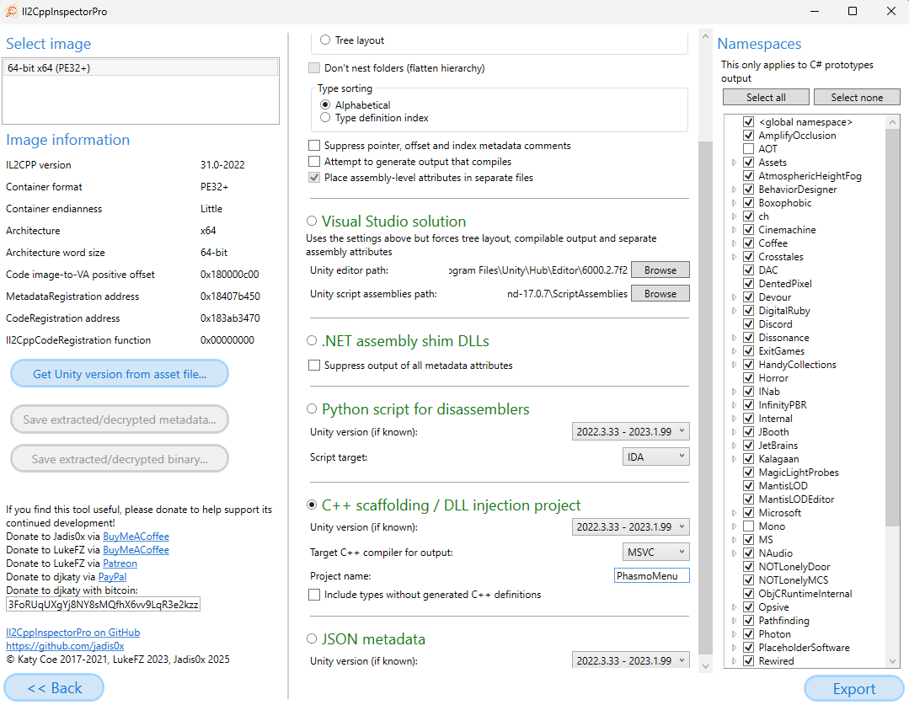
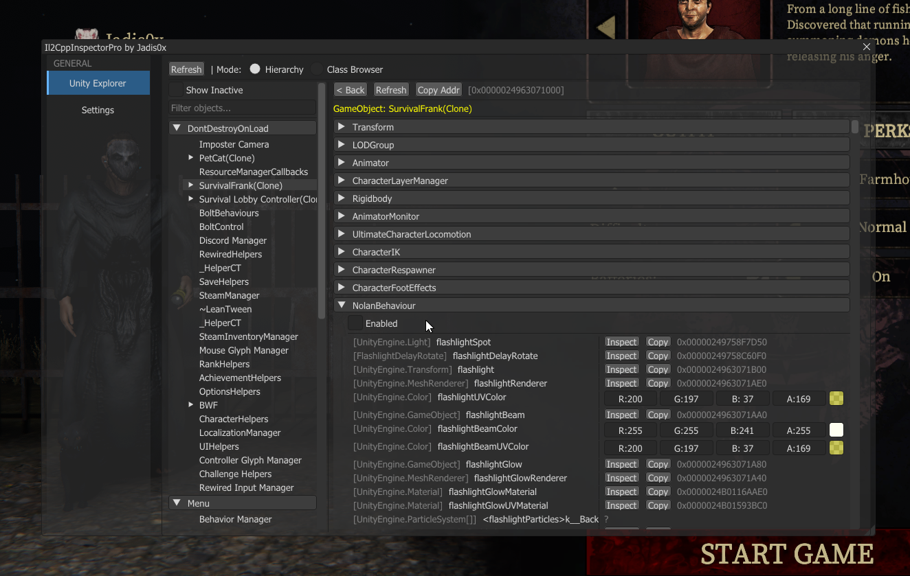

<h1 align="center">Il2CppInspectorPro</h1>

**Il2CppInspectorPro** is a high-performance C++ Modding SDK generator for IL2CPP-based applications. 

This tool automates the creation of a Visual Studio solution, providing a structured environment for runtime manipulation and advanced reverse engineering.

## Features
The generated SDK includes several pre-configured modules for immediate deployment:

### Dual Loading Modes (Proxy & Injector):
* Proxy Mode:
  - Includes a version.dll wrapper logic. When _VERSION is defined, the DLL acts as a proxy, loading automatically with the game.
* Injector Mode:
    - Standard entry point for manual injection if _VERSION is not utilized.

    
### Runtime Unity Explorer (Experimental):
An in-game hierarchy and object inspector.
- Allows browsing active GameObjects, inspecting Components, and modifying fields or properties in real-time.

> [!IMPORTANT]
> Under Construction.</strong> This feature is currently in active development. 
> Users may experience occasional instability or crashes during intensive object scanning or method invocation.

### Il2CppResolver:
A robust C++ wrapper for the IL2CPP domain.
- Provides dynamic class/method resolution and safe field access.
- Features a *Protection* layer with *safe_call* and *SafeRuntimeInvoke* to minimize crash risks during memory access.

### DirectX 11 & ImGui Scaffold:
Pre-configured DX11 hook with **Dear ImGui** backend for custom menu creation.
- Includes a modular tab system for rapid expansion of mod features.

### Hooking Scaffold:
Pre-linked with **Microsoft Detours** for seamless function interception.
- Includes a clean entry point in *main.cpp* for implementing persistent hooks and custom logic.
