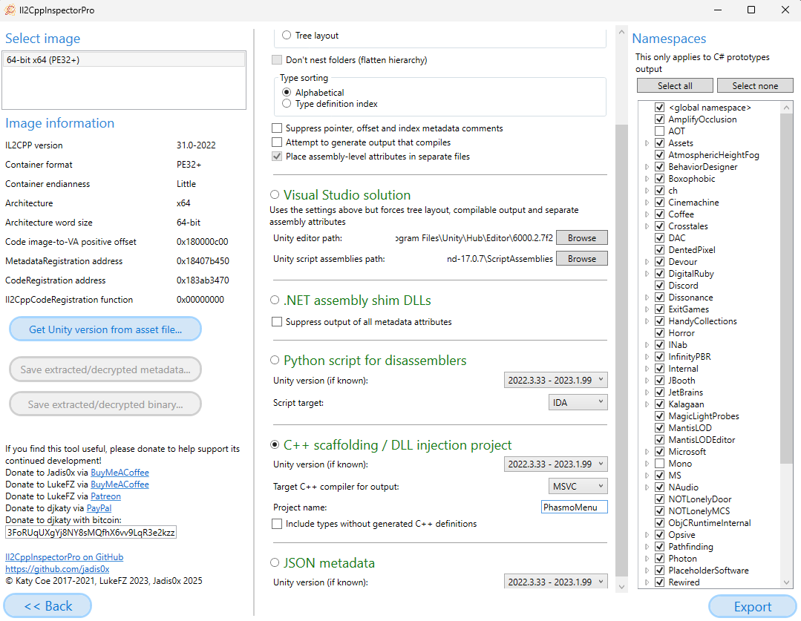

# Il2CppInspectorPro 2025

Il2CppInspectorPro helps you reverse engineer IL2CPP applications with complete metadata analysis, code scaffolding, and integration tooling. The project continues [Il2CppInspector by djkaty](https://github.com/djkaty/Il2CppInspector), which is no longer under active development, and ships new Unity metadata support alongside quality-of-life improvements.

## Feature highlights

- Support for metadata versions 29, 29.1, 31, 35 and 38, including full reconstruction of custom attributes.
- Accurate extraction of static array initializers with correct lengths.
- Proper handling of `Il2CppType` for v27.2+ and restored compatibility with v24.5 metadata.
- Export of static metadata fields and companion IDA scripts for ingesting the generated data.
- Complete support for `[ThreadStatic]` static fields and improved metadata usage heuristics.
- Performance improvements across the analysis pipeline.
- ...

## Il2CppInspectorPro vs. Il2CppInspectorRedux
Il2CppInspectorPro is a fork of LukeFZ/Il2CppInspectorRedux, focusing primarily on C++ scaffold generation and runtime integration (ImGui, Detours, etc.).
While Redux continues improving the analysis core and metadata parsing, Pro extends it toward native modding and injection workflows.

### License
This software is licensed under the AGPLv3.
